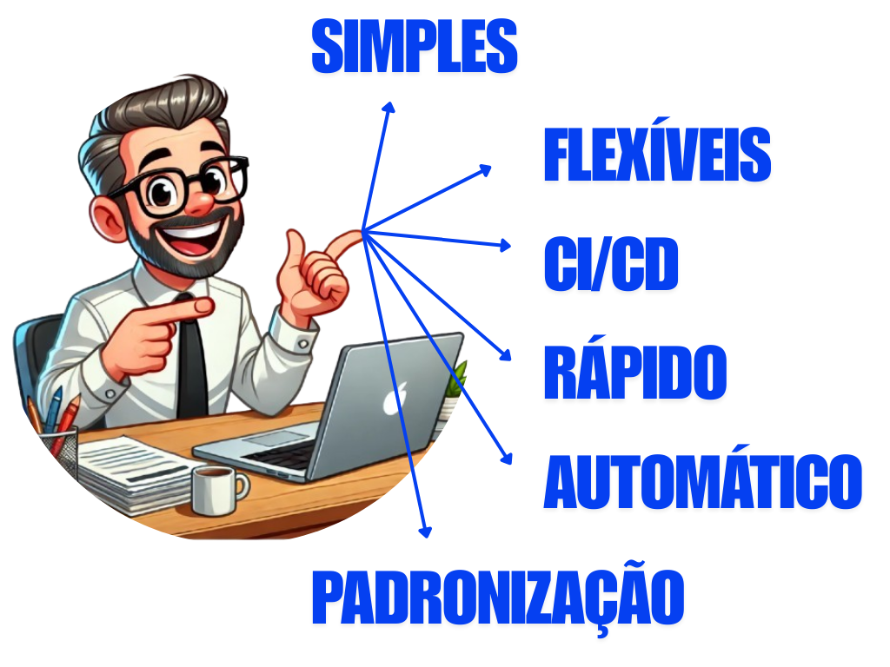

<!-- _class: lead -->


## Elaboração de materiais didáticos com Marp e CI/CD

**AUTORES**: Reinan Gabriel Dos Santos Souza
Prof. MSc. Francisco Rodrigues Santos
Prof. Dr. Gilson Pereira Dos Santos Junior

<!-- _footer: '07 de novembro de 2024' -->

---

<!-- _header: Sumário -->

- Problema
- Objetivo geral
- Solução
- Resultados
- Conclusão
- Trabalhos futuros
- Principais referências

---

<!-- _header: PROBLEMA -->

1. **Falta de padronização** nos materiais didáticos;
2. **Falta de integração** entre ferramentas de escrita e apresentação;
3. **Dificuldade em manter** e atualizar materiais didáticos;
4. **Carência de automatização** na elaboração de materiais didáticos;
5. **Complexidade** na utilização de códigos e fórmulas matemáticas.

---

<!-- _header: OBJETIVO GERAL -->

Apresentar uma abordagem para a elaboração de materiais didáticos **simples**, **flexíveis** e em **múltiplos formatos** utilizando o Marp.



<c>Fonte: Autor, (2024).</c>

> Marp: https://marp.app/

---
<!-- _class: image_with_font -->
<!-- _header: SOLUÇÃO -->


Fonte: Autor, (2024).

---

<!-- _class: image_with_font -->
<!-- _header: EXEMPLO DE ELABORAÇÃO DE MATERIAIS DIDÁTICOS PELO MARP  -->


Fonte: Autor, (2024).

---

<!-- _header: EXEMPLO DE BLOCO DE CÓDIGO  -->

Um exemplo de um bloco de escrito em Java e Python:

```java
class HelloWorld {
    public static void main(String[] args) {
        System.out.println("Hello, World!"); 
    }
}
```

```python
numeros = (1,2,3,4,5,6)

for i in numeros:
    print(i)
```

---

<!-- _header: EXPRESSÕES MATEMÁTICAS  -->

Um exemplo de expressão matemática escrita em LaTeX:

```tex
\begin{align*}
S(\omega) 
&= \frac{\alpha g^2}{\omega^5} \exp\left[ -0.74 \left\{ \frac{\omega U_\omega}{19.5 g} \right\}^{\!-4} \right] \\
&= \frac{\alpha g^2}{\omega^5} \exp \left[ -0.74 \left\{ \frac{\omega U_\omega}{19.5 g} \right\}^{-4} \right]
\end{align*}
```

$$
\begin{align*}
S(\omega) 
&= \frac{\alpha g^2}{\omega^5} \exp\left[ -0.74 \left\{ \frac{\omega U_\omega}{19.5 g} \right\}^{\!-4} \right] \\
&= \frac{\alpha g^2}{\omega^5} \exp \left[ -0.74 \left\{ \frac{\omega U_\omega}{19.5 g} \right\}^{-4} \right]
\end{align*}
$$


---
<!-- _class: image_with_font -->
<!-- _header: PIPELINE PARA AUTOMATIZAR A COMPILAÇÃO E PUBLICAÇÃO -->


Fonte: Autor, (2024).

> Link para a pipeline: https://github.com/ReinanHS/limarka-template-tcc/actions/runs/10801707397

---
<!-- _class: image_with_font -->
<!-- _header: RESULTADO DA PÁGINA DE PUBLICAÇÃO GERADO PELO CI/CD -->


Fonte: Autor, (2024).

> Link para a página: https://reinanhs.github.io/tcc-bsi-ifs/
> Link para o Limarka Page: https://github.com/ReinanHS/limarka-render-html

---

<!-- _header: CONCLUSÃO -->

- Facilidade e automação na criação de materiais didáticos.
- Integração eficiente de Marp com CI/CD.
- Otimização do tempo com automação de publicação e compilação.
- Acesso simplificado ao conteúdo por meio de uma página web.
- Flexibilidade na distribuição em múltiplos formatos.

---

<!-- _header: TRABALHOS FUTUROS -->

- Explorar a integração do Marp com outras ferramentas educacionais e de aprendizado.
- Ampliar a acessibilidade dos materiais didáticos gerados com Marp, focando em necessidades especiais.
- Implementar suporte para recursos interativos nos slides, como quizzes e feedback instantâneo.
- Avaliar o impacto do uso de Marp e CI/CD na melhoria do engajamento dos alunos.
- Realizar a implementação de novas validações no CI.

---

<!-- _header: PRINCIPAIS REFERÊNCIAS -->

**Marp (2024)**. Markdown presentation ecosystem. https://marp.app/. Acessado em: 31 ago. 2024.
**Tenen, D. and Wythoff, G. (2022)**. Autoria sustentável em texto simples usando pandoc e markdown. The Programming Historian em Português.
**Hofert, M. and Kohm, M. (2010)**. Scientific presentations with latex. The PracTEX Journal.
